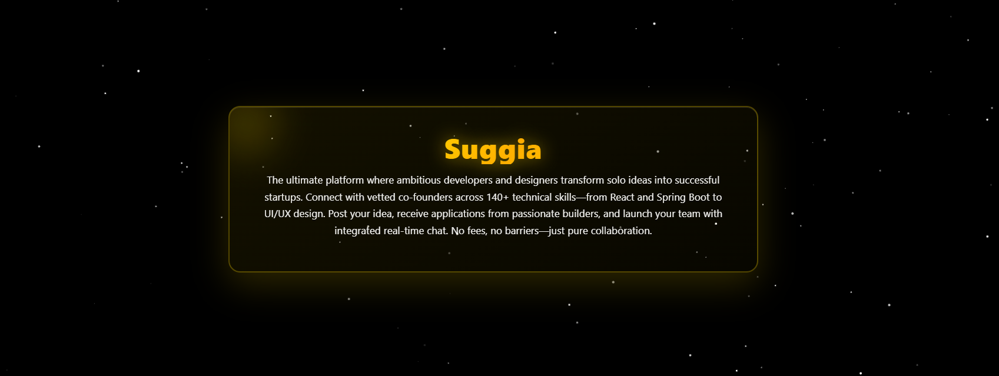
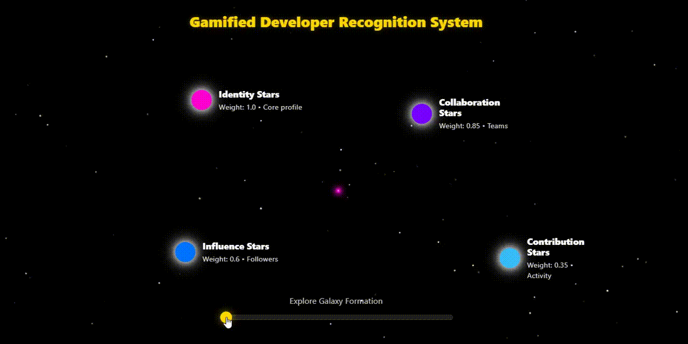

# Suggia - The Universe of Ideas

**A production-ready platform where startup ideas meet collaborators, powered by real-time messaging, gamification, and modular architecture.**

Built with senior-level engineering practices • Live with real users • Fully containerized and scalable

---

## What Makes Suggia Special?

<table>
<tr>
<td width="33%" valign="top">

### 🌐 Community-Driven
**Connect with collaborators worldwide**

- Search 27+ industry sectors
- Filter by skills, languages, experience
- Position-based team formation
- OAuth2 social login (Google, GitHub, LinkedIn)

</td>
<td width="33%" valign="top">

### ⚡ Real-Time Everything
**WebSocket-powered instant communication**

- STOMP messaging with Redis caching
- Per-user read receipts
- Online presence tracking
- Sub-10ms message delivery

</td>
<td width="33%" valign="top">

### 🎮 Gamification & Growth
**Reputation system that rewards contribution**

- 4 star types with weighted scoring
- 20+ achievements with unlock triggers
- Galaxy-themed level progression
- Fair reputation algorithm

</td>
</tr>
</table>

---

## A Universe of Ideas

*Space-themed UI with glassmorphism design and animated starfield backgrounds*

---

*Interactive ideas workspace - drag, zoom, and explore ideas in a dynamic 3D space*

---

*Dynamic galaxy visualization on user profiles showing level progression*

---

## 📖 Explore the Documentation

<table>
<tr>
<td width="50%" align="center">

### 🎯 [User Experience & Features](docs/FEATURES.md)

**Discover what Suggia offers**

Walk through the platform with 25+ screenshots and GIFs showing:
- Idea discovery and team formation
- Real-time messenger with advanced features
- Gamification system and achievements
- Community features and social interactions

**Perfect for:** Product managers, designers, recruiters

</td>
<td width="50%" align="center">

### ⚙️ [Technical Architecture](docs/TECHNICAL.md)

**Dive into the engineering**

Deep dive into the technical implementation:
- Modular Monolith architecture with 3 domains
- Multi-schema PostgreSQL + Redis caching
- WebSocket messaging with STOMP protocol
- Production infrastructure (Docker, Nginx, Cloudflare)

**Perfect for:** Software engineers, technical leads, architects

</td>
</tr>
</table>

---

### Project Stats

**11,314** lines of Java code • **3** independent modules • **31** JPA repositories • **39** service classes
**131** type-safe enums • **30+** database tables across 3 schemas • **Production-ready** and deployed

[▶️ Watch the full tutorial on YouTube](https://www.youtube.com/watch?v=k3H1lKf-ckE)

---

**Live Site:** https://suggia.com/ | **Tech Stack:** Spring Boot 3.5 • PostgreSQL 16 • Redis 7 • Docker

