# Sugguis Features - A Visual Tour

> **Experience a platform where startup ideas meet collaborators.** This guide walks you through the user journey with screenshots and GIFs showing every feature in action.

<div align="center">

[](https://suggia.com/)
[](../README.md)
[](TECHNICAL.md)

</div>

---

## Table of Contents
- [First Steps - Welcome & Onboarding](#first-steps---welcome--onboarding)
- [Finding Ideas - Discovery & Exploration](#finding-ideas---discovery--exploration)
- [Real-Time Collaboration - Messenger](#real-time-collaboration---messenger)
- [Your Universe - Profile & Gamification](#your-universe---profile--gamification)
- [Community & Discovery](#community--discovery)
- [Admin Tools - Behind the Scenes](#admin-tools---behind-the-scenes)
- [Watch the Full Tutorial](#watch-the-full-tutorial)

---

## First Steps - Welcome & Onboarding

### The Journey Begins

When you first land on Sugguis, you're greeted with an interactive welcome questionnaire that helps personalize your experience.

<div align="center">
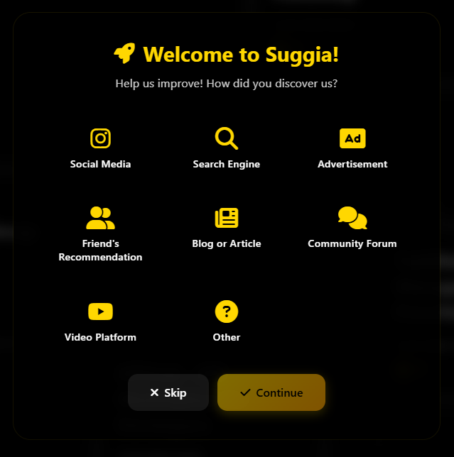
</div>

**What happens here:**
- Choose your role (Founder, Developer, Designer, etc.)
- Select your interests and skills
- Define your experience level
- Set collaboration preferences

This data is used to personalize your idea feed and match you with relevant opportunities.

---

## Finding Ideas - Discovery & Exploration

### The Ideas Galaxy

The main ideas page presents opportunities in an immersive, space-themed interface with animated starfields.

<div align="center">
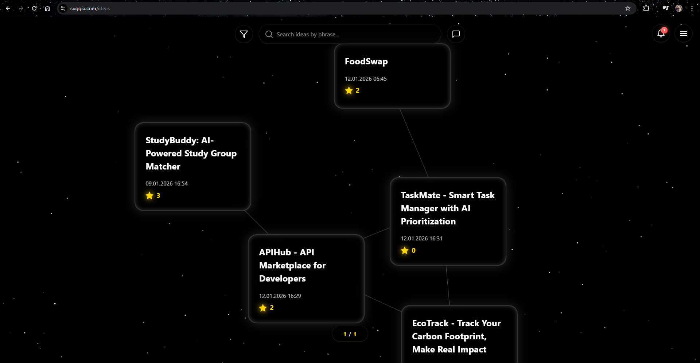
</div>

**Discovery features:**
- Browse ideas displayed as floating cards in a galaxy layout
- Filter by 27 industry sectors (FinTech, HealthTech, EdTech, etc.)
- Search with real-time autocomplete
- Sort by recent, popular, or most needed positions

---

### Advanced Filtering

Power users can use the advanced filter panel to narrow down ideas precisely.

<div align="center">
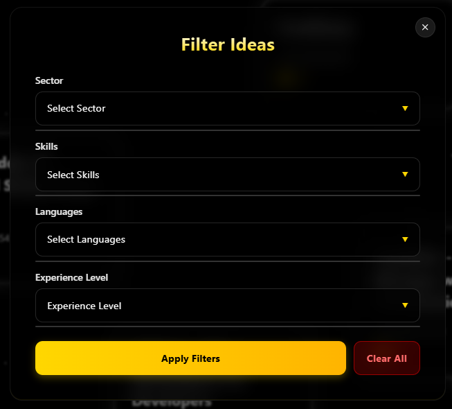
</div>

**Filter options:**
- Industry sector selection
- Required programming languages
- Team size and positions available
- Experience level requirements

---

### Diving Into an Idea

When you find something interesting, click to see the full details.

<div align="center">
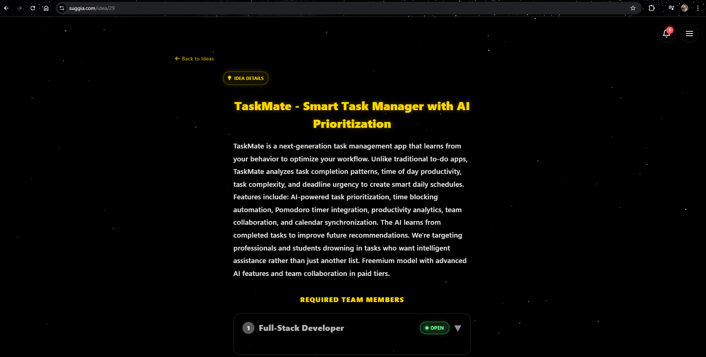
</div>

**What you'll see:**
- Full description and vision for the startup
- Required positions with detailed requirements
- Team members who've already joined
- Comments and discussions from the community
- Like and bookmark buttons for later

---

### Position Requirements

Each idea lists open positions with specific requirements.

<div align="center">
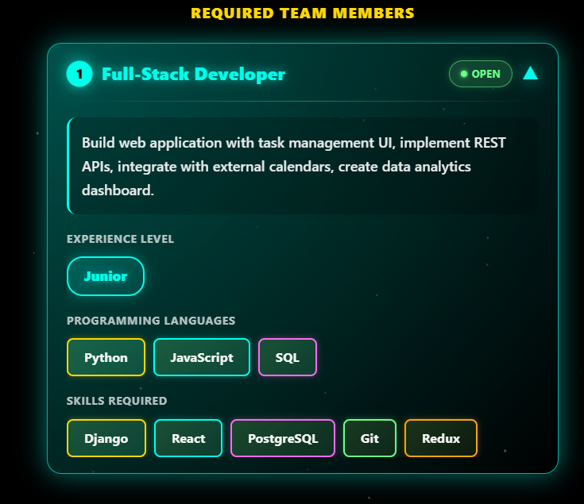
</div>

**Position details include:**
- Role title and responsibilities
- Experience level (Junior, Middle, Senior)
- Required programming languages and skills
- Apply button to join the team

---

### Adding Your Own Idea

Got a startup idea? The submission flow guides you through a 4-step process.

<div align="center">
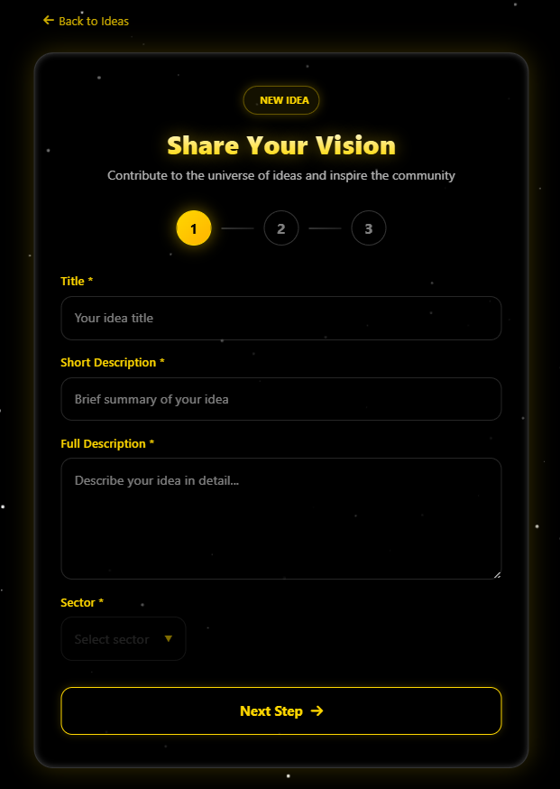
</div>

<div align="center">
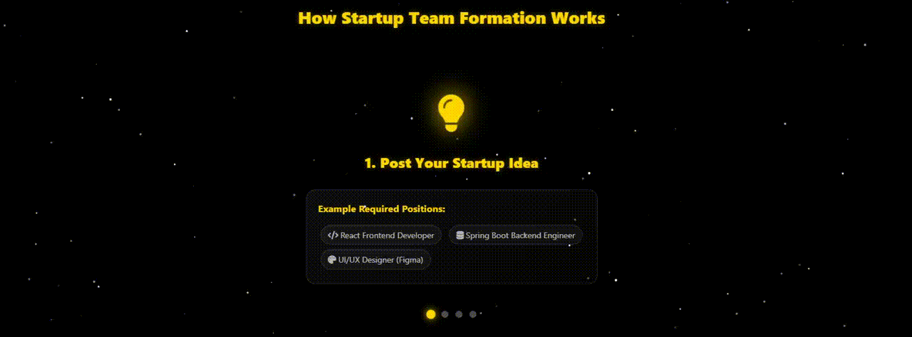
</div>

**Submission steps:**
1. **Basic Info** - Title, short description, industry sector
2. **Full Description** - Detailed vision (up to 5000 characters)
3. **Required Positions** - Define the team you need
4. **Review & Submit** - Final check before going live

---

## Real-Time Collaboration - Messenger

### Your Conversations Hub

Once you join a team, communication happens in real-time through the integrated messenger.

<div align="center">
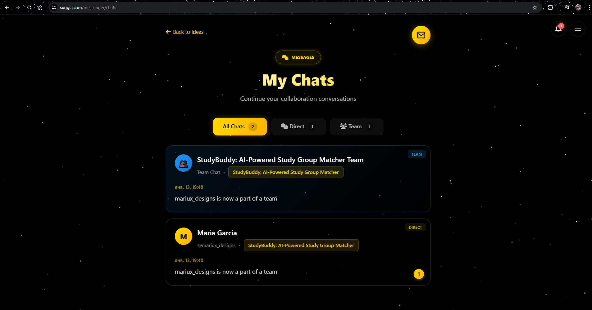
</div>

**Chat features:**
- List of all active conversations (direct and team chats)
- Unread message counters
- Online presence indicators
- Quick access to recent chats

---

### Inside a Conversation

The chat interface is clean, fast, and feature-rich.

<div align="center">

</div>

**What you get:**
- Real-time message delivery with WebSocket technology
- Typing indicators when others are composing
- Message timestamps with "Last seen" status
- File and link sharing

---

### Read Receipts That Actually Work

Unlike basic messengers, Sugguis tracks read status per user in team chats.

<div align="center">
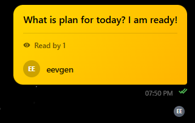
</div>

**How it works:**
- Each message shows who has read it
- Real-time updates when team members catch up
- Powered by Redis for sub-10ms response times
- No N+1 query issues even in large teams

---

### Presence & Status

Know when your team is online and available.

<div align="center">
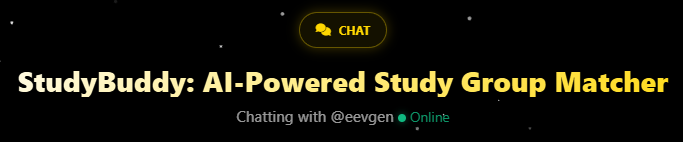
</div>

**Status indicators:**
- Green dot: Currently online
- Gray dot: Offline with "Last seen X minutes ago"
- Automatic status updates via WebSocket
- Privacy-respecting (users can control visibility)

---

### GitHub Integration

Connect your GitHub account to share code directly in conversations.

<div align="center">
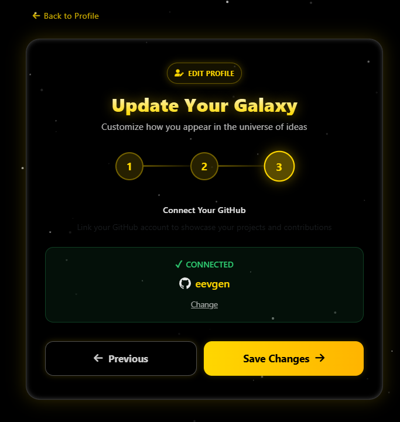
</div>

<div align="center">
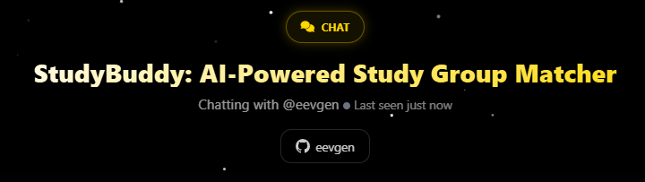
</div>

**Benefits:**
- One-click OAuth connection
- Share repos and commits in chat
- Verify technical credibility with your GitHub portfolio
- Automatic profile enrichment

---

## Your Universe - Profile & Gamification

### Your Public Profile

Your profile is your identity in the Sugguis community.

<div align="center">
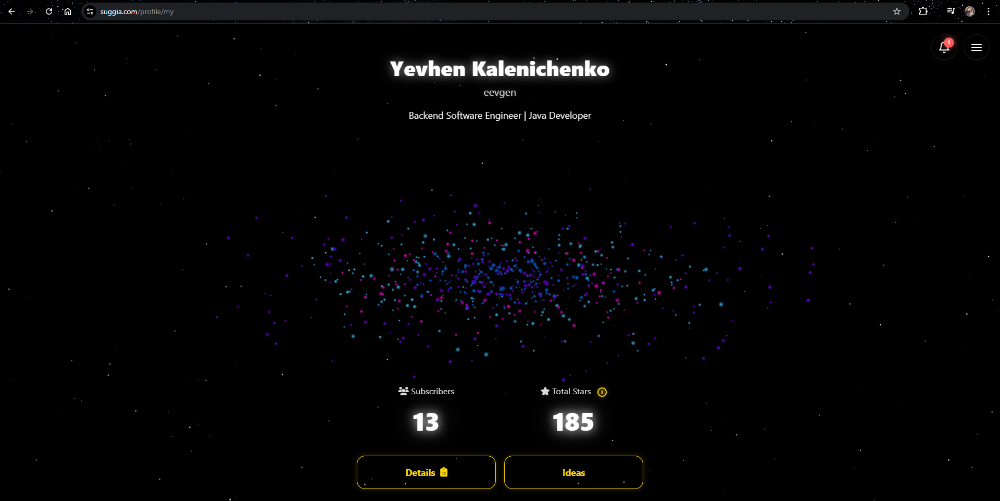
</div>

**Profile sections:**
- Galaxy visualization with animated stars (your level)
- Biography and collaboration preferences
- Skills, languages, and industry expertise
- Ideas you've created and teams you've joined
- Achievement showcase

---

### Profile Details

Detailed view showing your expertise and experience.

<div align="center">
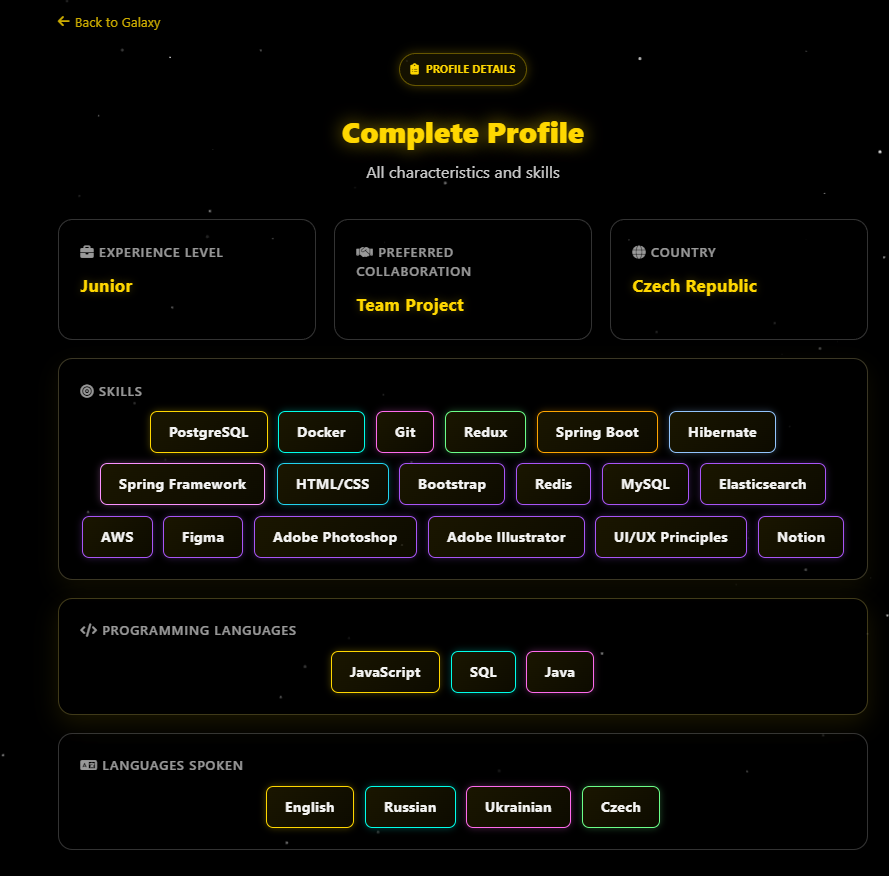
</div>

**What's included:**
- Experience level (Junior, Middle, Senior)
- Programming languages (11 options)
- Technical skills (25+ categories)
- Preferred collaboration type (Remote, Hybrid, Onsite)
- Industry sectors of interest

---

### The Achievement System

Unlock achievements as you contribute to the community.

<div align="center">
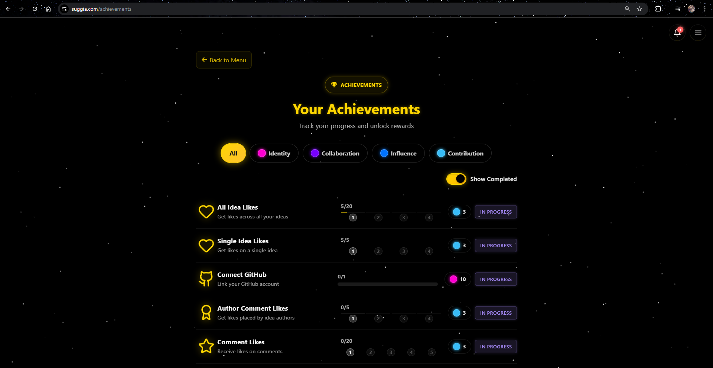
</div>

**Achievement categories:**
- **First Steps** - Registration, profile completion, first idea
- **Social Butterfly** - Following users, making friends, networking
- **Idea Guru** - Creating multiple ideas, getting likes, forming teams
- **Messenger Master** - Sending messages, active conversations
- **Community Leader** - Helping others, valuable comments, high reputation

**How it works:**
- 20+ achievements with unlock triggers
- Each achievement grants Achievement Stars (2.0 weight)
- Progress tracking shows how close you are to the next unlock
- Achievements are visible on your public profile

---

### The Star System

Sugguis uses a fair, weighted reputation system with 4 star types.

**Star Types & Weights:**
- ⭐ **Idea Star** (weight: 1.0) - Create an idea
- 💬 **Comment Star** (weight: 0.5) - Write valuable comments
- ❤️ **Like Star** (weight: 0.3) - Your ideas get liked
- 🏆 **Achievement Star** (weight: 2.0) - Unlock achievements

**Level Progression:**
```
Level = floor(log10(totalWeightedStars + 1) * 3)
```

This logarithmic formula ensures balanced progression that rewards consistent contribution over gaming the system.

---

### Save Ideas for Later

Found something interesting but not ready to commit? Save it for later.

<div align="center">
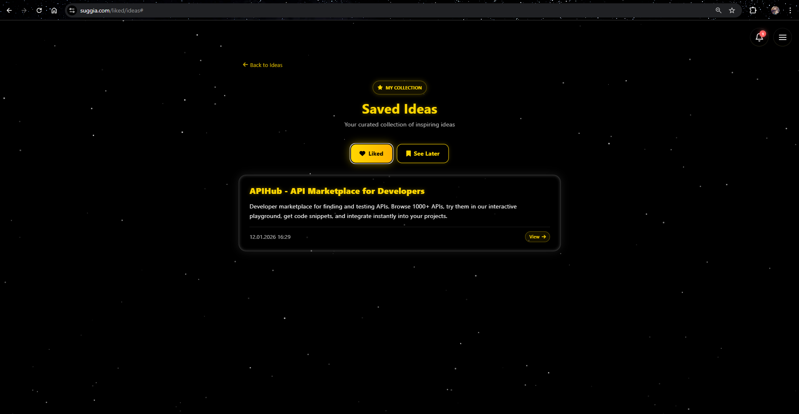
</div>

**Bookmarking features:**
- One-click save from any idea
- Organized favorites page
- Quick access from your profile menu
- No limit on saved ideas

---

## Community & Discovery

### Find Collaborators

Search for users by skills, languages, experience, and more.

<div align="center">
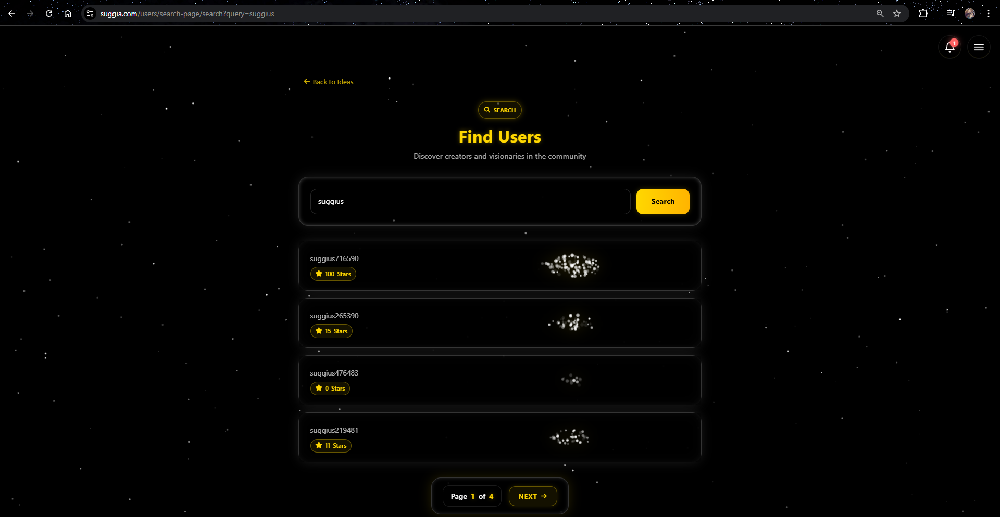
</div>

**Search filters:**
- Programming languages (Java, Python, JavaScript, etc.)
- Technical skills (Frontend, Backend, DevOps, etc.)
- Experience level
- Industry sectors
- Collaboration type (Remote, Hybrid, Onsite)

**Why this matters:** Finding the right co-founder or team member is often harder than coming up with the idea. Sugguis makes discovery effortless.

---

### Stay Updated with Notifications

Never miss important updates about your ideas and teams.

<div align="center">
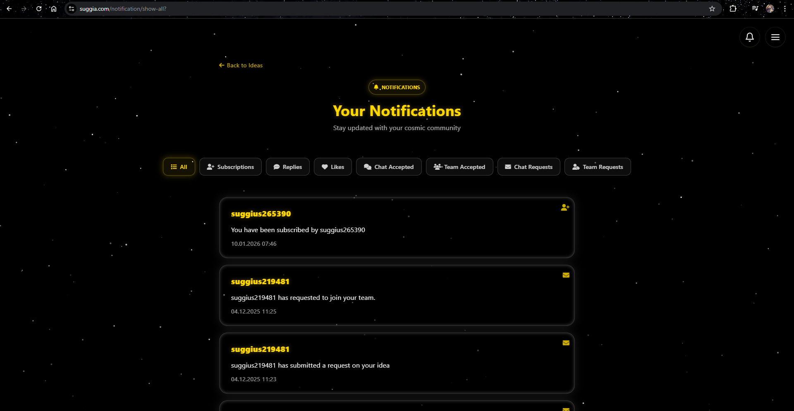
</div>

**Notification types:**
- New comments on your ideas
- Likes on your ideas or comments
- Team join requests
- New messages (with direct chat links)
- Achievement unlocks
- System announcements

---

### Notification Sidebar

Quick access to recent notifications without leaving the page.

<div align="center">
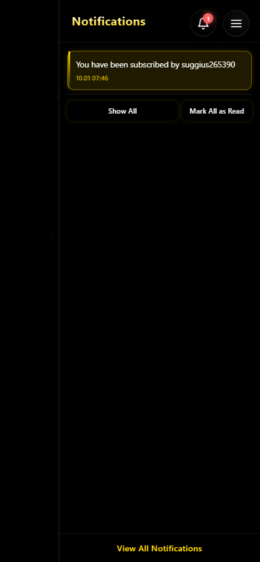
</div>

---

### Navigation Menu

The responsive menu gives quick access to all features.

<div align="center">
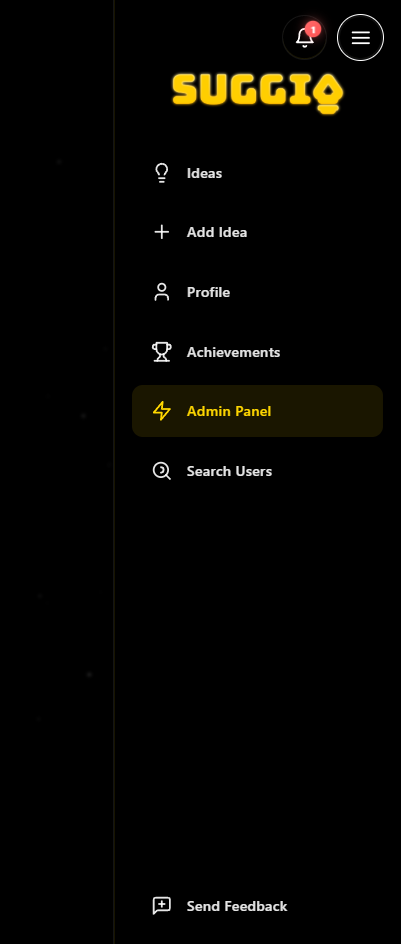
</div>

**Menu items:**
- Home / Ideas Galaxy
- My Profile
- Messenger
- Achievements
- Search Users
- Favorites
- Send Feedback
- Settings

---

## Admin Tools - Behind the Scenes

### Admin Dashboard

Platform owners get a comprehensive analytics dashboard.

<div align="center">
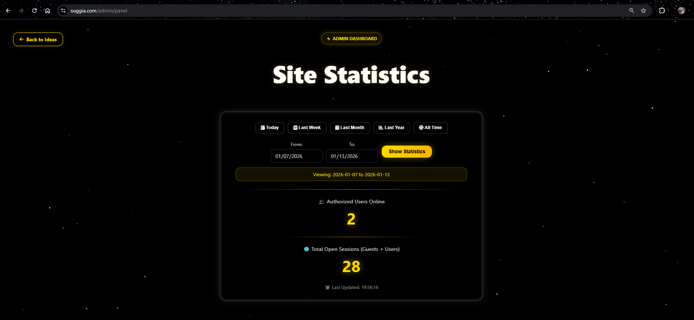
</div>

**Admin capabilities:**
- Track all user events (logins, registrations, idea creation)
- View daily statistics with date-range filtering
- Monitor user activity metrics
- Moderate content with soft-delete recycle bin
- Export data for analysis

---

### Statistics Panel

Detailed metrics show platform health at a glance.

<div align="center">
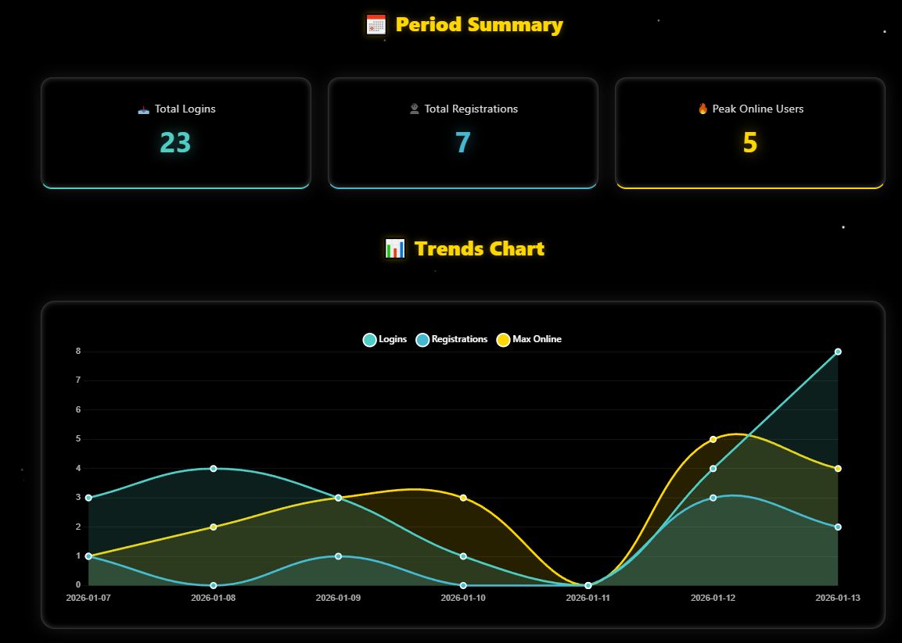
</div>

**Metrics tracked:**
- Daily active users (DAU)
- New registrations
- Ideas created
- Messages sent
- Engagement rates
- Retention metrics

**Technical note:** All events are tracked in the `achievement.site_events` table with daily aggregation for performance.

---

### User Feedback

Users can send feedback directly from the platform.

<div align="center">
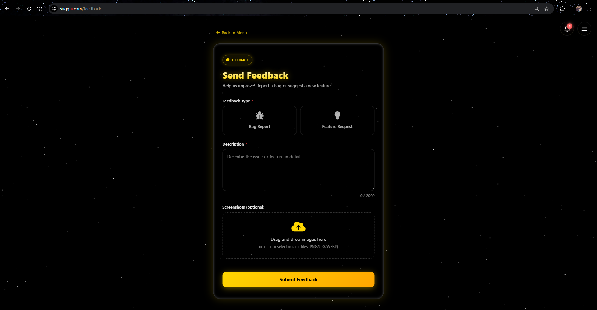
</div>

**Feedback features:**
- Category selection (Bug, Feature Request, General)
- Rich text input with markdown support
- Automatic user context (logged-in users include profile info)
- Email notifications to admins

---

## Watch the Full Tutorial

<div align="center">

### 🎥 Guided Video Tour

[](https://www.youtube.com/watch?v=k3H1lKf-ckE)

[▶️ Watch the complete walkthrough on YouTube (5 minutes)](https://www.youtube.com/watch?v=k3H1lKf-ckE)

---

See the platform in action with a narrated demo covering:
- User registration and OAuth login
- Creating and discovering ideas
- Real-time messaging features
- Gamification and achievements
- Team formation workflow

</div>

---

## Ready to Dive Deeper?

<table>
<tr>
<td width="50%" align="center">

### ← [Back to Overview](../README.md)

Return to the main README for quick navigation

</td>
<td width="50%" align="center">

### [Technical Architecture →](TECHNICAL.md)

Explore the engineering behind Sugguis

</td>
</tr>
</table>

---

<div align="center">

**Live Site:** https://suggia.com/ | **Repository:** [View on GitHub](../../)

*Built with Spring Boot 3.5, PostgreSQL 16, Redis 7, and Docker*

</div>
